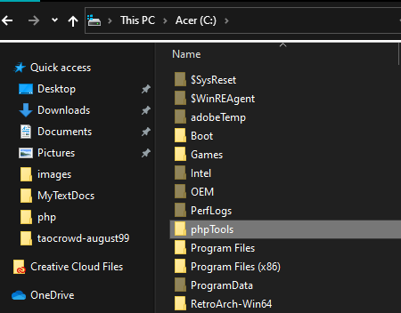

# The Network Exam

### Please make sure you already have your Git or Git Bash already setup/configured on your machine.
### Please make sure you are connected on the internet while doing this.

#### Download, install, configure and run one of this :
xampp mamp wamp lamp

#### Open your git bash or terminal or iterm depending on your machine :
cd into your mamp or wamp or xampp or lamp htdocs or www or your vhost root directory or folder.

I am using wamp and is slightly configured differently so `mine is located at C:\wamp64\www\vhosts\` and yours will most like be in `/www`or `/htdocs`

`cd C:/wamp64/www/vhosts` ( please mind the slashes if your having trouble with it )


#### Install wp-cli :

cd to where you want to install wp-cli
mine is on `C:\phpTools` for global setup

```cd C:/phpTools```

##### ex. phpTools



#### Download WP-CLI tool :

At these point you should already be running your xampp or wamp or mamp already.
```
curl -O https://raw.githubusercontent.com/wp-cli/builds/gh-pages/phar/wp-cli.phar
```
Confirm that it has been downloaded successfully.
```
php wp-cli.phar --info
```
Make the file executable globally.

ex.
#### Linux:
##### You need to set wp-cli.phar to be an executable file:
```
chmod +x wp-cli.phar
```

```
sudo mv wp-cli.phar /usr/local/bin/wp
```

#### Windows 10:
You need to set wp-cli.phar to be an executable file in two files.

##### Create a small batch file next to your *.phar to activate wp-cli in cmd:
`touch wp.bat` (take note of the name as this is the command you use in cmd)
ex.
wp-cli-for-cmd.png


##### Edit the file, add the following code, save and run the .bat file by double clicking:
```
@ECHO OFF
php %~dp0wp-cli.phar %*
```

ex.
edit-wp-cli-bat.png

so to use `"wp"` as the command, follow the instruction from the touch command above.

To use wp-cli in `"git bash"` create another file with the same name as the `.bat` file but no any extension.
and add this set of code and save.

```
#!/usr/bin/env sh

dir=$(d=${0%[/\\]*}; cd "$d"; pwd)

# See if we are running in Cygwin by checking for cygpath program
if command -v 'cygpath' >/dev/null 2>&1; then
    # Cygwin paths start with /cygdrive/ which will break windows PHP,
    # so we need to translate the dir path to windows format. However
    # we could be using cygwin PHP which does not require this, so we
    # test if the path to PHP starts with /cygdrive/ rather than /usr/bin
    if [[ $(which php) == /cygdrive/* ]]; then
        dir=$(cygpath -m $dir);
    fi
fi

dir=$(echo $dir | sed 's/ /\ /g')
"${dir}/wp-cli.phar" "$@"
```

ex.
wp-cli-for-git-bash.png

#### Search `environment variable` in your computer ( make sure you choose to edit system variable not your account only ) :
`Go to System’s Properties -> Advanced tab -> Environment Variables` ... 
On System variables section locate Path variable, select and press edit.

ex.
set-environment-variable.png

#### Add new variable and press ok 3x :

ex.
add-new-variable.png

#### Get back to your /www or /htdocs folder on your command line :
```
cd C:/wamp64/www/vhosts
```

### 2 ways to download wordPress :

#### First way :
Make sure you are on git bash for windows users.

```
curl -O https://wordpress.org/latest.tar.gz
tar -xvzf latest.tar.gz
```

Rename your extracted folder and `take note of its name` as this will be your url access to your local development website.

```
mv wordpress/ ./thenetworkexam
```

ex. thenetworkexam
thenetwork-folder.png

##### Remove tar.gz file:
```
rm -f latest.tar.gz
```

#### Second way: 
Create a name for your folder

```
mkdir thenetworkexam
```

ex. thenetworkexam
thenetwork-folder.png

```
wp core download
```

##### Create your database. Its up to you how you would do it either via browser phpmyadmin or via CLI.
###### I will use the browser :
wampserver.png

##### Go to `Databases` tab then enter your desired database name on the provided input box.
Please make sure you are using the `utf8_general_ci` for less issues in the future.
phpmyadmin-databases-tab.png

##### After creating your database, you should add a `virtual host` when using wamp.
wampserver-add-virtualhost.png
wampserver-add-virtualhost-2.png

##### Restart your wampserver to take effect.

Visit http://thenetwork.localdev to start installing wordpress.

## Troubleshooting:
If visiting the said url does not work.

##### Run notepad as administrator by right clicking the app and choosing run as administrator. #####
Locate windows hosts file on notepad by `ctrl + o`, and navigating to `C:\Windows\System32\drivers\etc` and displaying all files by clicking the dropdown below.

ex.
notepad-dropdown.png

##### Open hosts file and change the ip. #####
```
127.0.1.1 	thenetwork.localdev
```

##### Restart your wampserver to take effect. #####


#### Install your wordpress via browser and follow instructions :

Copy the repo url or ssh url from mygithub repo and clone it using your command line interface (CLI) 
and dont forget the dot at the very end.
git clone https://github.com/descifixer17/theNetworkExam.git .
clone-thenetworkexam.png

cd into folder.


## Resources :

#### Linux:
https://www.hostinger.ph/tutorials/wp-cli
#### Windows:
https://wensolutions.com/installing-wp-cli-in-windows/

## More Examples :
https://deluxeblogtips.com/install-wp-cli-windows/
https://maheshwaghmare.com/setup-wp-cli-wordpress-command-line-interface-on-windows-operating-system/
